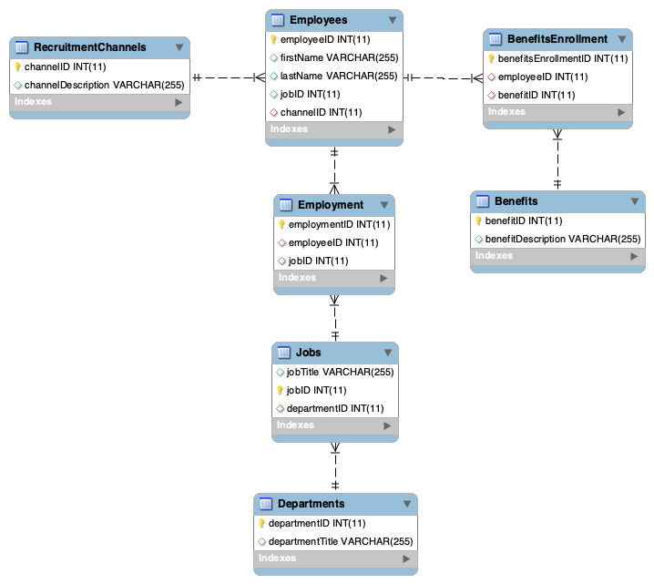

# University-SQL-Project

## Introduction
I created a database using MySQL Workbench for a fictional university's human resources data analytics department. The goal of this project is to support the department in answering relevant business questions and developing solutions to business problems.

## Create Database and its Tables
Sample queries.
```
CREATE DATABASE UniversityDatabase;
CREATE TABLE Benefits (
  benefitID int(11) NOT NULL AUTO_INCREMENT,
  benefitDescription varchar(255) DEFAULT NULL,  
  PRIMARY KEY (benefitID)
);
CREATE TABLE BenefitsEnrollment (
  benefitsEnrollmentID int(11) NOT NULL AUTO_INCREMENT,
  employeeID int(11) DEFAULT NULL,
  benefitID int(11) DEFAULT NULL,  
  PRIMARY KEY (benefitsEnrollmentID),
  KEY id (employeeID),
  KEY benefitID (benefitID),  
  CONSTRAINT benefitsenrollment_ibfk_1 FOREIGN KEY (employeeID) REFERENCES Employees (employeeID),  
  CONSTRAINT benefitsenrollment_ibfk_2 FOREIGN KEY (benefitID) REFERENCES Benefits (`benefitID`)
);
```

## Keys
An alternative to using one primary key column for the intermediate tables would be to use composite or compound keys since the combination of the 2 foreign keys would be unique. Ideally the minimum number of columns would be used to uniquely identify each row.

## Database Structure
The University database consists of the following tables: RecruitmentChannels, Employees, Employment, Jobs, Departments, BenefitsEnrollment, and Benefits. Refer to the entity relationship diagram (ERD) below to view the table relationships. RecruitmentChannels contains ways employees become aware of job openings, leading to them applying for the positions later on. 




## Many-to-Many Relationships
There is a many-to-many relationship between Employees and Jobs because an Employee may hold more than one Job at the university and a Job title could apply to multiple Employees. To show which Employees have which Jobs, I created an intermediate table, Employment, which contains foreign keys referencing the Employees and Jobs tables. Employment shows which Employees have which Jobs.

The cardinality is also many-to-many between Employees and Benefits: an Employee may enroll in more than one Benefit, and a Benefit may have multiple enrollees. BenefitsEnrollment  is an intermediate table between  Employees and Benefits, showing what Benefits each Employee is enrolled in.

## SELECT Queries
The resulting table of each query is shown beneath its associated SQL.

The below SELECT query returns data on employee first and last names, the department they work in, the job title they have, and what recruitment channel brought them to the job application.

```
SELECT Employees.firstName, Employees.lastName, Departments.departmentTitle, Jobs.jobTitle, RecruitmentChannels.channelDescription
FROM Departments
INNER JOIN Jobs ON Departments.departmentID = Jobs.departmentID
INNER JOIN Employment ON Employment.jobID = Jobs.jobID
INNER JOIN Employees ON Employment.employeeID = Employees.employeeID
INNER JOIN RecruitmentChannels ON Employees.channelID = RecruitmentChannels.channelID;  
```


This next query returns the most popular recruitment channels for each department in the university.

```
SELECT Departments.departmentTitle, RecruitmentChannels.channelDescription, count(\*)
FROM Departments
INNER JOIN Jobs ON Departments.departmentID = Jobs.departmentID
INNER JOIN Employment ON Employment.jobID = Jobs.jobID
INNER JOIN Employees ON Employment.employeeID = Employees.employeeID
INNER JOIN RecruitmentChannels ON Employees.channelID = RecruitmentChannels.channelID
GROUP BY Departments.departmentTitle, RecruitmentChannels.channelDescription)
```


This query shows the most popular benefits among employees.

```
SELECT Benefits.benefitDescription, count(\*)
FROM Employees
INNER JOIN BenefitsEnrollment ON BenefitsEnrollment.employeeID = Employees.employeeID
INNER JOIN Benefits ON Benefits.benefitID = BenefitsEnrollment.benefitID
GROUP BY Benefits.benefitDescription
```


## Fulfilling Business Needs
The HR analytics team could use the results of these queries to tailor their recruitment strategies and employee benefits package design. For example, the data could help them focus on the most effective recruitment channels. Knowing which benefits plans are most popular among employees could lead to further investigations in how to design benefits.
